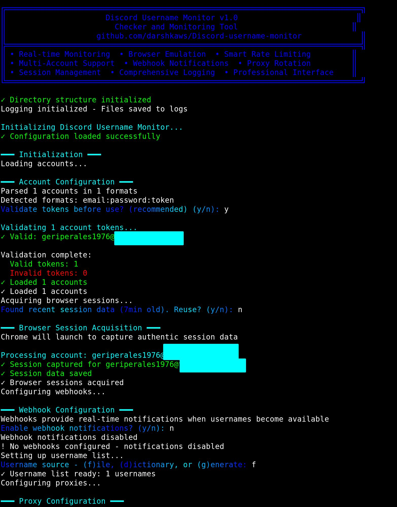

# Discord Username Monitor


A quick and professional Discord username checker tool with real-time notifications and browser-level authentication emulation.

## Features

- **Real-time Monitoring**: Continuously monitors username availability with intelligent cycling
- **Browser Emulation**: Uses Selenium to capture authentic browser sessions for enhanced reliability
- **Smart Rate Limiting**: Adaptive delays with proxy rotation to avoid rate limits
- **Multi-Account Support**: Supports various account formats (email:password:token, email:token, token-only)
- **Webhook Notifications**: Instant Discord notifications when usernames become available
- **Session Management**: Persistent session handling with automatic cleanup
- **Proxy Support**: Built-in proxy rotation with multiple source options
- **Comprehensive Logging**: Detailed logs for monitoring and debugging

## Installation

### Prerequisites

- Python 3.8 or higher
- Google Chrome browser
- Discord account(s) with valid tokens

### Dependencies

```bash
pip install -r requirements.txt
```

### Quick Setup

1. Clone the repository:
```bash
git clone https://github.com/darshkaws/Discord-username-monitor.git
cd Discord-username-monitor
```

2. Install dependencies:
```bash
pip install -r requirements.txt
```

3. Prepare your configuration files:
   - Add your tokens to `accounts/tokens.txt`
   - Configure webhooks when prompted
   - Set up your username list

4. Run the monitor:
```bash
python src/main.py
```

## Configuration

### Account Formats

The tool supports multiple account formats in `accounts/tokens.txt`:

```
# Format 1: email:password:token
user@example.com:password123:your_discord_token_here

# Format 2: email:token  
user@example.com:your_discord_token_here

# Format 3: token only
your_discord_token_here
```

### Username Lists

Choose from multiple username sources:
- **File**: Load from text file (one username per line)
- **Dictionary**: Use English dictionary words (requires NLTK)
- **Generated**: Create random usernames with specified length

### Webhook Configuration

Configure Discord webhooks for real-time notifications:
- Single webhook for all notifications
- Separate webhooks for different username categories (rare, 4-char, standard)

## Usage

### Basic Usage

1. Run the main script:
```bash
python src/main.py
```

2. Follow the interactive configuration:
   - Select monitoring mode (auto-claim or notifications-only)
   - Configure webhook URLs
   - Choose username source
   - Set up proxy configuration (optional)
   - Configure performance settings

3. Monitor the console output for real-time statistics

### Advanced Configuration

Edit `config/settings.json` for advanced options:

```json
{
  "monitoring": {
    "thread_count": 15,
    "delay_min": 0.1,
    "delay_max": 1.0,
    "session_timeout": 300
  },
  "captcha": {
    "service_url": "https://freecaptchabypass.com",
    "client_key": "your_captcha_key"
  }
}
```

## Monitoring Modes

### Semi-Auto Mode (Recommended)
- Monitors username availability
- Sends webhook notifications when usernames become available
- Provides account credentials for manual claiming
- Lower risk of account restrictions

### Auto-Claim Mode (Experimental)
- Automatically attempts to claim available usernames
- Uses both discord.py and browser session fallback
- **Note**: Auto-claiming may encounter CAPTCHA challenges
- Higher risk due to automated claiming attempts

## Output Files

The tool generates several output files:

- `logs/sniper_log.txt`: Detailed operation log
- `results/available_usernames.txt`: Found available usernames with credentials
- `logs/error_log.txt`: Error logs for debugging
- `data/session_stats.json`: Session statistics and performance metrics

## Rate Limiting & Best Practices

- Uses intelligent rate limiting to avoid Discord's restrictions
- Proxy rotation helps distribute requests
- Browser emulation provides authentic request patterns
- Persistent sessions reduce authentication overhead

## Troubleshooting

### Common Issues

1. **Session capture fails**: Ensure Chrome is installed and accessible
2. **High rate limiting**: Reduce thread count or add proxy rotation
3. **Token validation errors**: Verify token format and account status
4. **Webhook notifications not working**: Test webhook URLs manually

### Debug Mode

Enable detailed logging by setting environment variable:
```bash
export DEBUG_MODE=1
python src/main.py
```

## Legal Notice

This tool is for educational and research purposes. Users are responsible for:
- Complying with Discord's Terms of Service
- Respecting rate limits and API guidelines  
- Using legitimate account credentials
- Following applicable laws and regulations

## Contributing

Contributions are welcome! Please read our [Contributing Guidelines](CONTRIBUTING.md) before submitting pull requests.

### Development Setup

1. Fork the repository
2. Create a virtual environment
3. Install development dependencies:
```bash
pip install -r requirements-dev.txt
```
4. Run tests:
```bash
python -m pytest tests/
```

## License

This project is licensed under the MIT License - see the [LICENSE](LICENSE) file for details.

## Support

- **Issues**: Report bugs via GitHub Issues
- **Documentation**: Check the `docs/` directory for detailed guides
- **Community**: Join discussions in GitHub Discussions

## Acknowledgments

- Built with modern Python async/await patterns
- Uses curl-cffi for advanced TLS fingerprinting
- Selenium WebDriver for authentic browser emulation
- Discord.py for API interactions

---

**Disclaimer**: This tool is provided as-is for educational purposes. The developers are not responsible for any misuse or violations of service terms.